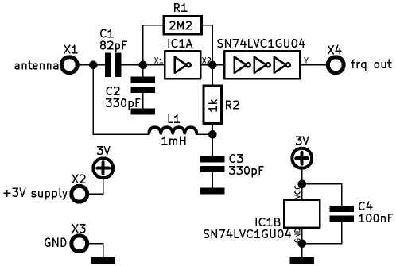
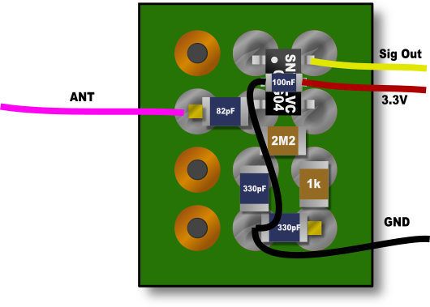

A digital Theremin based on the STM32 microcontroller.

* Easy to build: Only a STM32 evaluation board and 2 oscillators for a basic
and cheap Theremin
* Excellent audio quality: 16/24bit audio DAC with headphone amplifier
* Loads waveforms with Theremin sound directly from an USB stick
* Very fast autotune: 1sec
* Powerful ARM Cortex-M4 microcontroller with DSP, FPU and 168MHz clock

# Hardware
The STM32F407G-DISC1 evaluation board can be used.
So you need only 2 additional oscillators for basic operation.  

# Example of an LC colpitts oscillator 
### Schematic

### Bill of material
| Component     | Pitch        | Volume       | Price | Supplier   |
| ------------- | ------------ | ------------ | ----- | ---------- |
| C1            | 82pF         | 100pF        | 0.05$ | [m](http://www.mouser.com), [f](http://www.farnell.com), [d](http://www.digikey.com) |
| C2            | 330pF        | 390pF        | 0.05$ | [m](http://www.mouser.com), [f](http://www.farnell.com), [d](http://www.digikey.com) |
| C3            | 330pF        | 390pF        | 0.05$ | [m](http://www.mouser.com), [f](http://www.farnell.com), [d](http://www.digikey.com) |
| C4            | 100nF        | 100nF        | 0.05$ | [m](http://www.mouser.com), [f](http://www.farnell.com), [d](http://www.digikey.com) |
| R1            | 2M2          | 2M2          | 0.05$ | [m](http://www.mouser.com), [f](http://www.farnell.com), [d](http://www.digikey.com) |
| R2            | 1k           | 1k           | 0.05$ | [m](http://www.mouser.com), [f](http://www.farnell.com), [d](http://www.digikey.com) |
| L1            | 1mH          | 1mH          | 0.50$ | [m](http://www.mouser.com), [f](http://www.farnell.com), [d](http://www.digikey.com) |
| IC            | SN74LVC1GU04 | SN74LVC1GU04 | 0.40$ | [m](http://www.mouser.com), [f](http://www.farnell.com), [d](http://www.digikey.com) |
| Total         |              |              | **1.20$** |            |

**Suppliers:**  
m: www.mouser.com  
f: www.farnell.com / www.newark.com  
d: www.digikey.com  

## Breadboard
The oscillators can be build up with SMD components on a breadboard.
So no extra PCB is necessary:  

