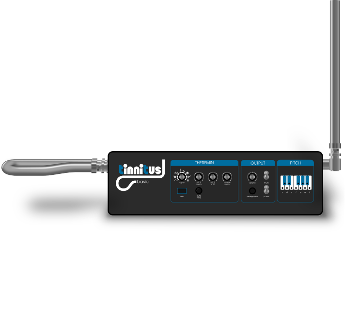
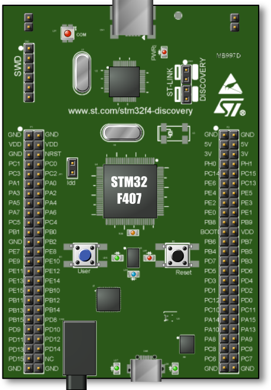
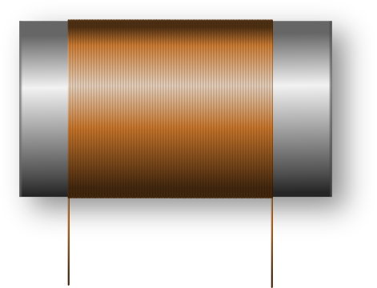
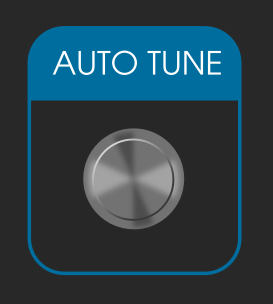
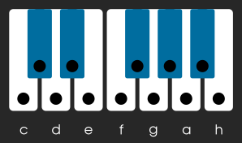
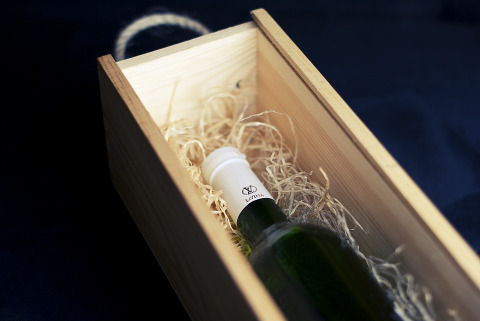
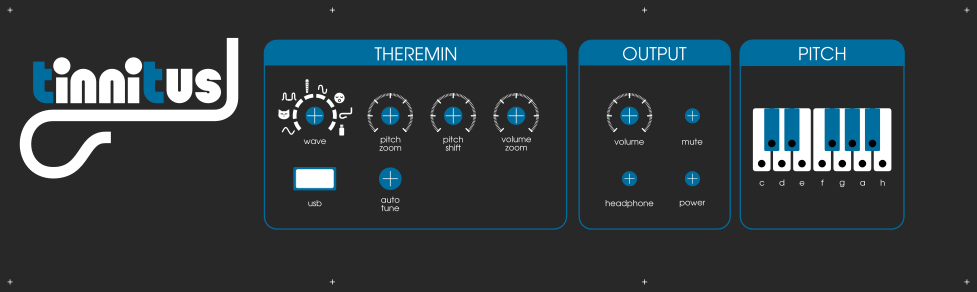

### A very cheap and easy to build Theremin for only 30..50$

* Only an STM32 evaluation board, 2 oscillators and some knobs and switches needed.
* Excellent audio quality: 16/24bit audio DAC with headphone amplifier
* Can load waveforms with Theremin sound directly from an USB stick
* Very fast autotune: 1sec

# Hardware
The STM32F407G-DISC1 evaluation board can be used.
So you need only 2 additional oscillators and some pots.

# Example of an LC colpitts oscillator
### Schematic

### Bill of material
| Component     | Pitch        | Volume       | Price | Supplier   |
| ------------- | ------------ | ------------ | ----- | ---------- |
| C1            | 82pF         | 100pF        | 0.05$ | [m](http://www.mouser.com), [f](http://www.farnell.com), [d](http://www.digikey.com) |
| C2            | 330pF        | 390pF        | 0.05$ | [m](http://www.mouser.com), [f](http://www.farnell.com), [d](http://www.digikey.com) |
| C3            | 330pF        | 390pF        | 0.05$ | [m](http://www.mouser.com), [f](http://www.farnell.com), [d](http://www.digikey.com) |
| C4            | 100nF        | 100nF        | 0.05$ | [m](http://www.mouser.com), [f](http://www.farnell.com), [d](http://www.digikey.com) |
| R1            | 2M2          | 2M2          | 0.05$ | [m](http://www.mouser.com), [f](http://www.farnell.com), [d](http://www.digikey.com) |
| R2            | 1k           | 1k           | 0.05$ | [m](http://www.mouser.com), [f](http://www.farnell.com), [d](http://www.digikey.com) |
| IC            | SN74LVC1GX04 | SN74LVC1GX04 | 0.40$ | [m](http://www.mouser.com), [f](http://www.farnell.com), [d](http://www.digikey.com) |

**Suppliers:**
m: www.mouser.com
f: www.farnell.com / www.newark.com
d: www.digikey.com

L1 should be an air-coil with 1mH. Eg. 200 windings of 0.15mm wire on a core with 40mm diameter.

Use http://hamwaves.com/antennas/inductance.html for other diameters.

## Breadboard
The oscillators can be build up with SMD components on a breadboard.
So no extra PCB is necessary:

## Pin maps

| Name       | PIN Name | Connector | Description                                    |
| ---------- | -------- | --------- | ---------------------------------------------- |
| GND        | GND      | P1        | Ground for oscillators and potentiometers      |
| VDD        | VDD      | P1        | 3V supply for oscillators and potentiometers   |
| PITCH_OSC  | PE9      | P1        | Signal from pitch oscillator                   |
| VOLUME_OSC | PE11     | P1        | Signal from volume oscillator                  |
| ANALOG_1   | PA1      | P1        | Analog input from volume potentiometer         |
| ANALOG_2   | PA2      | P1        | Analog input from zoom volume potentiometer    |
| ANALOG_3   | PA3      | P1        | Analog input from shift pitch potentiometer    |
| ANALOG_4   | PC4      | P1        | Analog input from zoom pitch potentiometer     |
| ANALOG_5   | PC5      | P1        | Analog input from waveform potentiometer       |

## Auto-tune
The blue button on the STM32 discovery board starts the Auto-Tune procedure.

You can also use an additional button and connect it to:

| Name       | PIN Name | Connector | Description                   |
| ---------- | -------- | --------- | ----------------------------- |
| VDD        | VDD      | P1        | 3V supply auto-tune button    |
| Auto-tune  | PA0      | P1        | Signal from auto-tune button  |

## Pitch LED display
Optional display to show the current played note one a piano like display.

Connect 3mm LEDs with a series resistor of 100R to these PINs and connect all
cathodes of to GND:

| Name         | PIN Name | Connector | Description                                    |
| ------------ | -------- | --------- | ------------------------ |
| PITCH LED 0  | PE12     | P1        | Note c                   |
| PITCH LED 1  | PE14     | P1        | Note cis                 |
| PITCH LED 2  | PE15     | P1        | Note d                   |
| PITCH LED 3  | PB11     | P1        | Note dis                 |
| PITCH LED 4  | PB12     | P1        | Note e                   |
| PITCH LED 5  | PB13     | P1        | Note f                   |
| PITCH LED 6  | PB14     | P1        | Note fis                 |
| PITCH LED 7  | PB15     | P1        | Note g                   |
| PITCH LED 8  | PD8      | P1        | Note gis                 |
| PITCH LED 9  | PD9      | P1        | Note a                   |
| PITCH LED 10 | PD10     | P1        | Note b                   |
| PITCH LED 11 | PD11     | P1        | Note h                   |

## USB-stick with sound file
It's possible to store a \*.WAV or a \*.C file on an USB-stick and use it as sound source for the theremin.
#### WAV file
The file name must be **WAV1.WAV** and it must contain 1 periode of a sound sample. File format must be WAV (Microsoft) and the data format signed 16 bit PCM with only one mono track. Use Audacity to export it. https://www.audacityteam.org/ 
#### C file
The file name must be **WAV1.C** and it must contain 1 periode of a sound sample. File format must be the same as the Audio Wavetables from the Open.Theremin V3 project. http://www.gaudi.ch/OpenTheremin/index.php/download/audio-wavetables 

## Programming software for STM32
Program the STM32 board with the [STM32CUBEPROG](http://www.st.com/content/st_com/en/products/development-tools/software-development-tools/stm32-software-development-tools/stm32-programmers/stm32cubeprog.html) tool.

## Case and front panel
As case a wooden wine box could be used.

The cheapest way for a professional looking front panel would be to use the service of a sign manufacturer. For example:
https://www.digitaldruck-fabrik.de/werbeschilder/hart-pvc-polystyrolplatte.aspx

Price of a 380x110mm front panel is about 4€ or 5$

You can use the template under hardware/Frontpanel, but you have to adapt the size of the front panel file to your wine box. Use eg. https://inkscape.org

